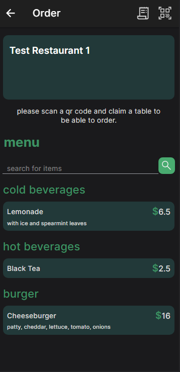

# PROJECT-FINAL-VERSION

**System Architecture Document**

**Problem Definition:**

Restaurants and cafes that are not too large or small usually work with 3 – 4 people. Going to those cafes and trying to order is difficult because they have to come to each table to get the orders. Instead with this application anyone can order and waiters can see the orders immediately.

**So the problems to be solved by this application are:**

- To be able to order comfortably and immediately.
- Get the stock information about products that are on the menu.
- To be able to process the orders by waiters.

**SYSTEM ARCHITECTURE**

**Client Requirements:**

    >> ( for customers)
    • scanning qr code and claiming the table if it is available.
    • function to add to order and send the order to the table which has the matching owner id.
    • function to call a waiter for help or request the check.
    • function to search for items in the menu by name.
    
    >> ( only logged in admins are allowed to see or do the things below )

    • ( for admins ) see tables grid, current orders and waiter requests.
    • ( for admins ) functions to manipulate the menu.
    • ( for admins ) function to complete or cancel the orders.
    • ( for admins ) function to manipulate table information such as ( owned, reserved, empty/available).
 
 **Client Functions**
- Register/Login_(for admins)_
- List shops
- Search for shops
- Scan qr code at the table to claim a table:
  - Scan qr code to get table info.
  - PUT request to rails API to claim the table if available.
  - Table&#39;s owner id is generated randomly on the client and saved to localStorage and sent to server too.
- List the items on the menu for a specific shop.
- Search for items on the menu.
- Add to order.
- Send order.
- View the check/bill.

**FOR logged in ADMINS**
  - View tables
  - View and complete current orders()
  - View waiter requests.
  - View and manipulate items.

GET _https://orderhere.herokuapp.com/shops/:shop\_id/items_

_PUT_ [_https://orderhere.herokuapp.com/shops/:shop\_id/_](https://orderhere.herokuapp.com/shops/:shop_id/tables/:table_id/order_items)_items/:item\_id_

**Server:**

To communicate with the postgresql database, this app will use a rails API.

- Register/Login(for admins)
- Provide all the necessary routes for the client functions to work. Mostly CRUD operations.
- Authorize only the logged in users under admin route and to see the following pages:
  - AdminOrders, AdminTables, AdminTableDetails, AdminMenu

- Server actions to handle are:
  - **shops#search**
  - **items#index**
  - **items#create**
  - **items#show**
  - **items#update**
  - **items#update**
  - **items#destroy**
  - **requests#index**
  - **requests#create**
  - **requests#destroy**
  - **order\_items#index**
  - **order\_items#create**
  - **order\_items#update**
  - **order\_items#update**
  - **Order\_items#current**
  - **tables#index**
  - **tables#create**
  - **tables#show**
  - **tables#update**
  - **tables#update**
  - **tables#destroy**
  - **shops#index**
  - **shops#create**
  - **shops#show**
  - **shops#update**
  - **shops#update**
  - **shops#destroy**
  
**MODULES AND APIs**

**Client:**

- **react** =\&gt; javascript framework
- **react-router** =\&gt; navigate between pages
- **ionic-react** =\&gt; some ionic components
- **nanoid** =\&gt; generate randomized strings for keys
- **barcode-scanner** for capacitor =\&gt; scan qr codes
- **context** =\&gt; react context api to be able to pass props to each level of the app
- **storage** for capacitor =\&gt; local storage implementation
- **axios** =\&gt; make http requests

**API:**

- **rails**
- **devise** =\&gt; authentication
- **devise-token-auth** =\&gt; authentication
- **pundit** =\&gt; authorization
- **pg** =\&gt; postgresql implementation
- **jbuilder** =\&gt; to create json responses
- **backend API deployed at** [API](https://orderhere.herokuapp.com/shops/:shop_id/tables/:table_id/order_items)

**Pages:**

- **Customer (no need to log in)**
 - Welcome Page

- Register Page

  - Login Page

  - Shops Page

  - Order Page

 - Order Page -> Order Slider

- **Admin (logged in only)**
  - AdminOrders Page

  - Admin Tables Page

  - AdminTableDetails Page

  - AdminMenu Page

**Database:**

